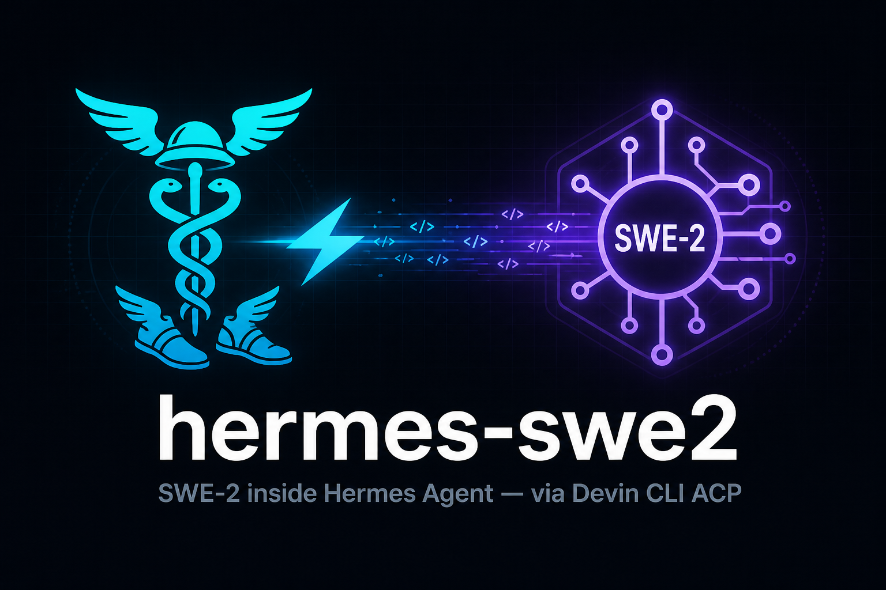
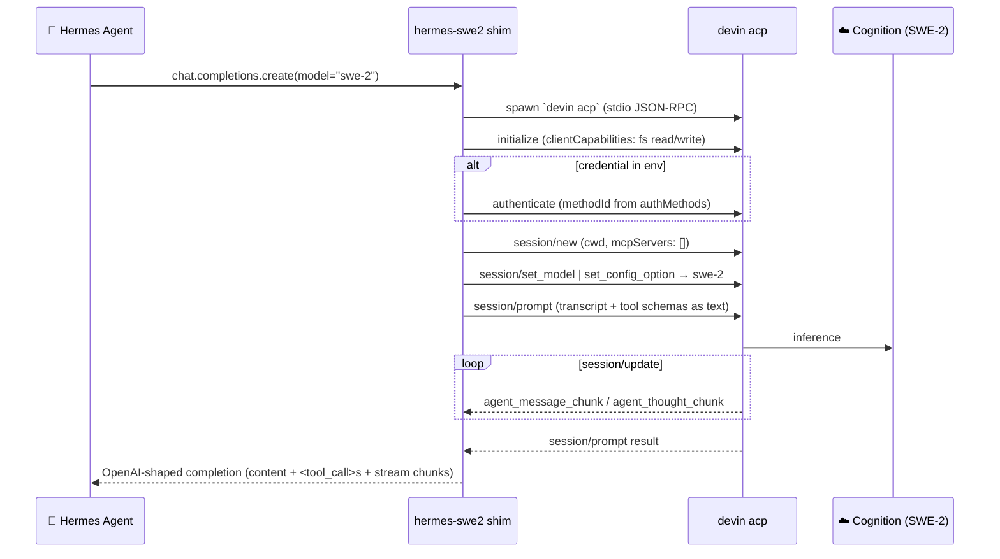

<div align="center">



# ⚡ hermes-swe2

**Run Cognition's SWE-2 as a first-class model inside [Hermes Agent](https://github.com/NousResearch/hermes-agent) — powered by your own [Devin CLI](https://docs.devin.ai/cli).**

[](LICENSE)
[](pyproject.toml)
[](plugin.yaml)
[](https://docs.devin.ai/cli/reference/commands#devin-acp)
[](https://agentclientprotocol.com)
[](CONTRIBUTING.md)

</div>

---

## 🧠 What is this?

Cognition's **SWE-2** is one of the strongest software-engineering models available — but it has **no public inference API**. What Cognition *does* ship is `devin acp`: a documented **Agent Client Protocol** server built so third-party editors (Zed, Windsurf, …) can drive Devin as a subprocess.

**hermes-swe2 turns that editor surface into a Hermes model provider.** Hermes talks ACP to your locally installed `devin` binary — the same wire Zed uses — and SWE-2 becomes a selectable model in `hermes model`, `hermes --provider`, the TUI, and the gateway. Same seam as the bundled `copilot-acp` provider, zero core edits.

> [!IMPORTANT]
> **Bring your own Devin subscription.** The plugin never stores, proxies, or shares credentials — `devin auth login` (or `WINDSURF_API_KEY` / `DEVIN_API_KEY`) stays on your machine.

## ✨ Features

- 🔌 **Drop-in provider** — registers as `devin`; `--provider devin`, `hermes model`, `hermes setup`, and `hermes doctor` pick it up automatically
- 🧬 **SWE family picker** — `swe-2`, `swe`, `swe-1-7`, `swe-1-7-lightning`, `swe-1-6-fast` as fallbacks; live `availableModels`/`configOptions` negotiated over ACP when offered
- 🛠️ **Full tool calling** — Hermes tool schemas cross the bridge as `<tool_call>` blocks; Hermes keeps executing tools itself
- 🌊 **Streaming** — `session/update` chunks map back to OpenAI stream chunks
- 🔒 **Fail-closed** — permission prompts denied, `fs/*` requests confined to the session cwd
- ⚙️ **Zero-config override hooks** — custom binary/argv via env vars
- 📦 **Three install paths** — `hermes plugins install`, manual drop-in, or pip entry point

## 🏗️ How it works



Hermes' tool loop is preserved: Devin's *own* tools are never invoked (permission requests are cancelled, fs bridge is cwd-scoped), so `<tool_call>` blocks flow back to Hermes, which executes them and loops — Hermes stays the agent, SWE-2 stays the brain.

## 📦 Install

<details open>
<summary><b>1️⃣ <code>hermes plugins install</code> (recommended)</b></summary>

```bash
hermes plugins install https://github.com/GodsBoy/hermes-swe2
# lands in $HERMES_HOME/plugins/hermes-swe2/ — kind: model-provider routes it
# to the provider registry automatically
```

</details>

<details>
<summary><b>2️⃣ Manual drop-in</b></summary>

```bash
mkdir -p ~/.hermes/plugins/model-providers/devin
cp __init__.py plugin.yaml devin_provider.py devin_acp_client.py \
   ~/.hermes/plugins/model-providers/devin/
```

</details>

<details>
<summary><b>3️⃣ pip entry point</b></summary>

```bash
pip install git+https://github.com/GodsBoy/hermes-swe2.git
# then add "devin" to plugins.enabled in ~/.hermes/config.yaml
```

</details>

### Prerequisites

```bash
# Devin CLI
curl -fsSL https://cli.devin.ai/install.sh | bash

# authenticate once (or export WINDSURF_API_KEY / DEVIN_API_KEY)
devin auth login
```

### Select the model

```bash
hermes model                      # → "Devin CLI (SWE-2)" → swe-2
hermes --provider devin --model swe-2
hermes doctor                     # confirms the `devin` binary resolves
```

## ⚙️ Configuration

| Env var | Default | Purpose |
| --- | --- | --- |
| `HERMES_DEVIN_ACP_COMMAND` | `devin` | Override the CLI binary path |
| `DEVIN_CLI_PATH` | — | Alternative binary-path override |
| `HERMES_DEVIN_ACP_ARGS` | `acp` | Override argv (shlex-split) — e.g. `acp --model swe-2` |
| `DEVIN_API_KEY` / `WINDSURF_API_KEY` | — | Credential handed to the child + offered via ACP `authenticate` |

Model ids are Devin CLI short names (`swe-2`, `swe`, `opus`, `sonnet`, `codex`, `gemini`, …); they resolve server-side to the latest family member. Unlisted or policy-disabled ids fall back to the session default with a warning in `agent.log`.

## 🔍 Troubleshooting

<details>
<summary><b>"Could not find the 'devin' CLI command"</b></summary>

`devin` isn't on `PATH` for the Hermes process. Install it, or point at it:

```bash
export HERMES_DEVIN_ACP_COMMAND=/full/path/to/devin
```

</details>

<details>
<summary><b>Model silently stays on the session default</b></summary>

The ACP session advertised a model list that didn't include your pick (e.g. an enterprise allowlist filtered SWE-2 out). Check `~/.hermes/logs/agent.log` for the `does not offer model` warning.

</details>

<details>
<summary><b>Auth errors / devin asks to log in</b></summary>

Run `devin auth login` in a terminal first, or export `WINDSURF_API_KEY`. Remote/SSH boxes: `devin setup --force-manual-token-flow`.

</details>

## ⚖️ Terms-of-use notes

This plugin deliberately uses the **documented** `devin acp` interface — the same one Cognition built for third-party editors. No reverse engineering, no private endpoints, no credential extraction.

- ✅ Each user authenticates their own Devin CLI — no credential sharing
- ❌ Don't use SWE-2 output to build/train a competing model or product (Cognition Platform Terms §2.3)
- ❌ Don't publicly publish benchmarks of the service (Enterprise MSA §2.3(v))
- ℹ️ Enterprise model allowlists / team settings still apply inside Devin CLI

## 🧪 Tests

```bash
HERMES_REPO=/path/to/hermes-agent \
  uv run --with openai --with pytest --with pyyaml --with httpx \
  python -m pytest tests/ -q
```

Fully offline — covers registration, the prompt/tool bridge, ACP model-selection logic, and cwd confinement. No `devin` binary required.

## 🗂️ Repo layout

```
├── plugin.yaml          # kind: model-provider manifest
├── __init__.py          # directory-plugin entry → devin_provider.register()
├── devin_provider.py    # DevinACPProfile + register() (pip entry point target)
├── devin_acp_client.py  # self-contained ACP stdio client (OpenAI-shape shim)
├── pyproject.toml       # optional pip install
├── tests/               # offline unit tests
└── assets/              # banner & friends
```

## 🤝 Contributing

Issues and PRs welcome. Hermes-side conventions live in
[`plugins/AGENTS.md`](https://github.com/NousResearch/hermes-agent/blob/main/plugins/AGENTS.md) —
this is intentionally an **out-of-tree** plugin (their policy for vendor integrations).

---

<div align="center">

Built for 🪽 [Hermes Agent](https://hermes-agent.nousresearch.com) · Powered by ⚡ [SWE-2](https://cognition.com/blog/swe-2) · MIT Licensed

</div>
